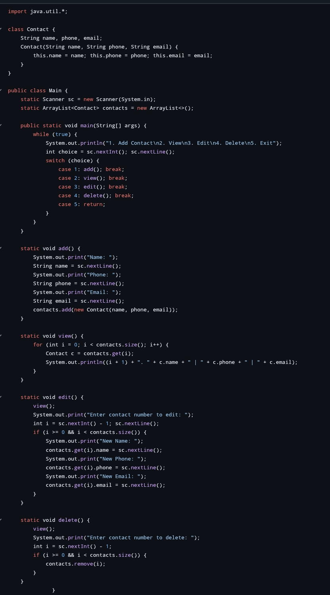

# Prodigy-infotech-task-3
Software development internship 

# Prodigy Infotech Task 3 - Student Grade Calculator 🧮

## 🔹 Internship Domain:
**Software Development Intern**  
**Platform:** Prodigy Infotech  
**Task Number:** 3  

## 🔸 Task Title:
**Student Grade Calculator using Java**

## 📌 Task Objective:
Design and implement a Java program that takes the marks of five subjects from the student and calculates the **total**, **average**, and **grade** based on the average score.

---

## 💻 Features:
- Accepts marks for 5 subjects  
- Calculates total and average  
- Determines grade using average  
- Easy to modify or expand

---

## 🧠 Grade Criteria:

| Average Marks | Grade  |
|---------------|--------|
| 90 - 100      | A+     |
| 80 - 89       | A      |
| 70 - 79       | B      |
| 60 - 69       | C      |
| 50 - 59       | D      |
| Below 50      | F (Fail) |

---

## 📷 Screenshots:
  


---

## 📝 How to Run:
1. Clone the repository  
2. Open `Task3.java` in any Java IDE (e.g., IntelliJ, Eclipse) or terminal  
3. Compile using `javac Task3.java`  
4. Run using `java Task3`  
5. Enter marks when prompted

---

## 📁 Files:
- `Task3.java` – Java Source Code  
- `README.md` – This documentation  
- `Screenshot_*.jpg` – Output Proof  

---

## ✅ Output Sample:
```bash
Enter marks for Subject 1: 87
Enter marks for Subject 2: 92
Enter marks for Subject 3: 76
Enter marks for Subject 4: 81
Enter marks for Subject 5: 89

Total Marks: 425
Average: 85.0
Grade: A


---

🙌 Certificate Purpose:

This repository serves as proof of Task-3 completion for the Prodigy Infotech Software Development Internship.


